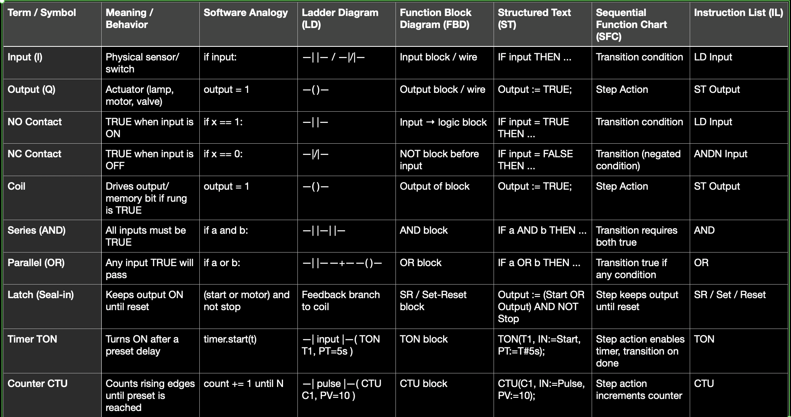

# IEC-61131-3-PLC-Programming-Beginner-Friendly

A **concise, programmer-friendly tutorial** on PLC basics and the **IEC 61131-3 standard**.

---

## 1. PLC Basics

**What is a PLC?**

* A **Programmable Logic Controller** is an industrial computer for automation.
* It reads **inputs** (sensors, switches), executes logic, and drives **outputs** (motors, lamps, valves).

**PLC Scan Cycle:**

```python
while True:
    read_inputs()
    execute_program()
    update_outputs()
```

---

## 2. IEC 61131-3 Standard

Defines **five programming languages**:

1. **Ladder Diagram (LD)** – relay style (most common)
2. **Function Block Diagram (FBD)** – function blocks & wires
3. **Structured Text (ST)** – high-level code (Pascal-like)
4. **Sequential Function Chart (SFC)** – flowchart/state machine
5. **Instruction List (IL)** – assembly-like (deprecated)

---

## PLC Terms Across IEC 61131-3 Languages
    
    > **Note:** “Normally” in **NO/NC** means the device’s idle state. STOP/E-Stop is **NC** so if wire breaks → machine stops safely.

## 4. IEC 61131-3 Languages

### 4.1 Ladder Diagram (LD)

**Style:** Graphical, relay-circuit style

**Examples:**

Lamp turns ON when switch is pressed:

Ladder:

```
[Switch] —| |———( Lamp )
```

Programming way:

```python
if switch == 1:
    lamp = 1
else:
    lamp = 0
```

Start/Stop Motor (Latch circuit):

Ladder:

```
[Start] —| |——+——( Motor )
               |
[Motor] —| |—-+
[Stop]  —|/|———|
```

Programming way:

```python
if start == 1 or motor == 1:   # motor stays latched
    if stop == 0:              # stop button not pressed
        motor = 1
    else:
        motor = 0
```

Once you see ladder as just IF-ELSE with symbols, it becomes much clearer.

**Common Ladder Symbols:**

* **—| |— (NO contact):** TRUE when input is ON → `if switch == 1:`
* **—|/|— (NC contact):** TRUE when input is OFF → `if switch == 0:`
* **—( )— (Coil):** Output device, turns ON if rung TRUE → `lamp = 1`


---

### 4.2 Function Block Diagram (FBD)

**Style:** Functions connected with wires

Start/Stop latch:

```
Start ─┐
Motor ─┼─[ OR ]──┐
Stop  ─[ NOT ]───┘
             ↓
           [ AND ]── Motor
```

Timer 5s:

```
(Start AND NOT Stop) ──> TON T1 (PT=5s) ──> Motor
```

```python
# Timer ON (5s) logic
if Start == 1 and Stop == 0:   # Start pressed and Stop not pressed
    # Timer counts up (waits for 5s) — simulated as already reached
    Motor = 1                  # Motor turns ON after timer elapsed
else:
    Motor = 0                  # Motor OFF if input condition not met
```
---

### 4.3 Structured Text (ST)

**Style:** High-level code (Pascal-like)
**Lamp when switch pressed:**

```Structured Text
IF Switch THEN
    Lamp := TRUE;
ELSE
    Lamp := FALSE;
END_IF;
```

```python
if switch == 1:
    lamp = 1
else:
    lamp = 0
```

**Start/Stop latch:**

```Structured Text
IF (Start OR Motor) AND (NOT Stop) THEN
    Motor := TRUE;
ELSE
    Motor := FALSE;
END_IF;
```

```python
# Motor stays ON once started until Stop is pressed.
if Start == 1 or Motor == 1:   # motor stays latched
    if Stop == 0:              # stop button not pressed
        Motor = 1
    else:
        Motor = 0
else:
    Motor = 0
```

---

### 4.4 Sequential Function Chart (SFC)

**Style:** Flowchart/state machine

Example:

```
[Idle] --(Start)--> [Delay 5s] --(T1.Q)--> [Run] --(Stop)--> [Idle]
```

Code analogy:

```python
if state == "Idle" and Start and not Stop:
    state = "Delay"
elif state == "Delay" and T1.Q:
    state = "Run"
elif state == "Run" and Stop:
    state = "Idle"
```

---

### 4.5 Instruction List (IL) — Legacy

Assembly-like, deprecated.


---

## 5. Common PLC Patterns

| Case                     | Ladder                    | ST Equivalent                                          |              |                   |
| ------------------------ | ------------------------- | ------------------------------------------------------ | ------------ | ----------------- |
| Lamp when switch pressed | \`\[Switch] —             |                                                        | ——( Lamp )\` | `Lamp := Switch;` |
| Start/Stop latch         | Seal-in rung with Stop NC | `Motor := (Start OR Motor) AND NOT Stop;`              |              |                   |
| Start → 5s → Motor       | TON with PT=5s            | `T1(IN := Start AND NOT Stop, PT:=5s); Motor := T1.Q;` |              |                   |
| Count 10 pulses          | CTU PV=10, DN → buzzer    | `C1(IN:=Pulse, PV:=10, R:=Reset); Buzzer := C1.Q;`     |              |                   |

---

## 6. Practical Tips

* **Scan cycle:** Inputs → logic → outputs.
* **STOP = NC:** ensures **fail-safe**.
* **Seal-in latch:** most common interview rung.
* **Timers:** TON (delay ON), TOF (delay OFF), TP (pulse).
* **Counters:** CTU needs reset.
* **Debounce:** use one-shots for clean counts.
* **Naming:** `Start_PB`, `Stop_PB_NC`, `Motor_Run`.

---
